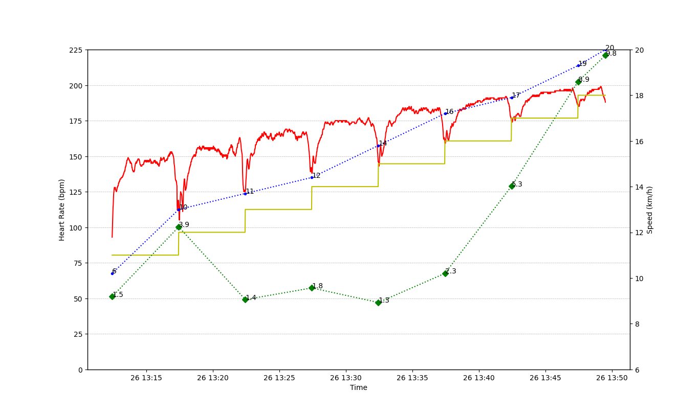

# LactateTest

Utility to plot the data of a Lactate Test.
In main.py, update the test settings and the measurements.

## Test settings
Initial speed: speed at which the test was started.
Time interval: interval at which the speed was increased.
Speed increment: by how much the speed was increased at each step.
Basal measurement: whether a measurement was taken before the start of the test.
End measurement: whether a measurement was taken at the end of the test (which wasn't at the end of a interval).
Tcx file: the name of the tcx file produced in the test (needs to be in the same folder).

## Test measurements
RPE: rate of perceived exertion (use the scale you prefer)
Lactate: lactate measurements

## Example
